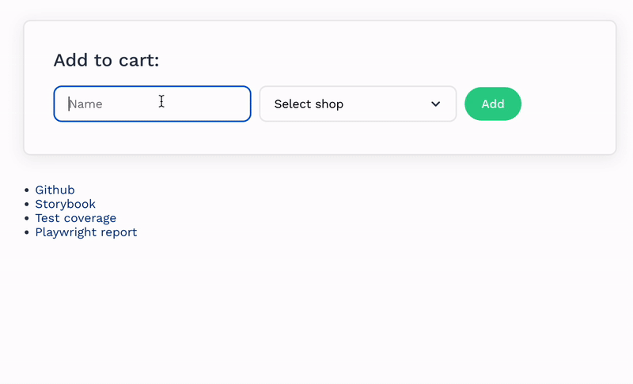
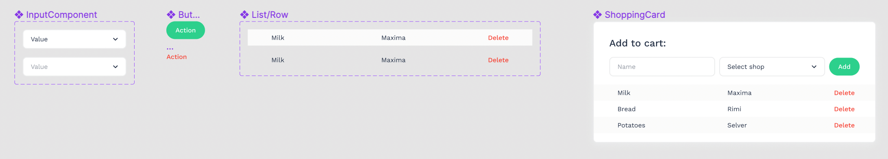
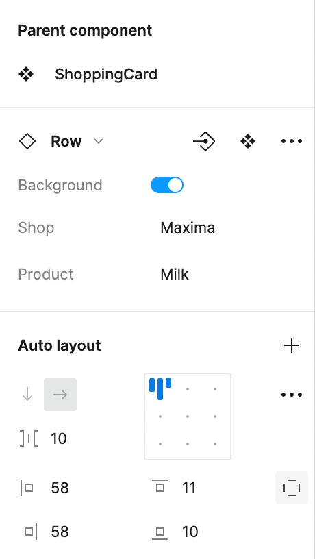
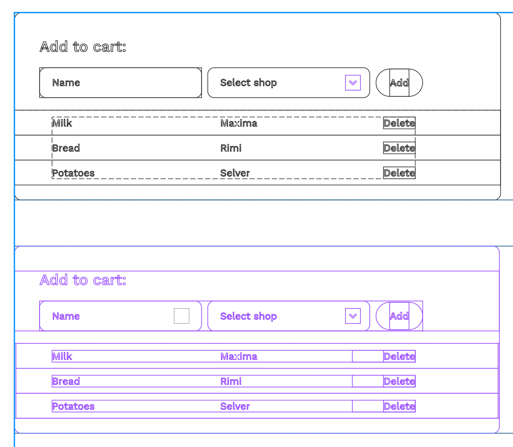

I hope you find this interesting

# cart-component

- **Demo:** https://cart-component.andreisoroka.com/
- Test coverage: https://cart-component.andreisoroka.com/coverage/
- Playwright report: https://cart-component.andreisoroka.com/playwright-report/
- Storybook: https://cart-component.andreisoroka.com/storybook/

<details>
<summary>Demo: React memo</summary>

> Highlight updates when components render:
>
> 
</details>

<details>
<summary>Demo: Figma update</summary>

> I am not a designer, yet I possess skills in working with Figma.
> I had the honor of adding structure to the Figma file.
>
> Added components:
>
> 
>
> With variables:
>
> 
>
> X-Ray (was/became):
>
> 
>
> You can download: [Updated Figma file](doc%2FShopping%20card%20%28Remake%29.fig)
>
> I think: An engineer should possess the ability to comprehend concepts across a wide range of disciplines,
> not just within their own field of expertise.
>
> P.s. In truth, I just needed a structure before beginning the project creation. 😀
</details>

## Table of Contents

- [cart-component](#cart-component)
    - [My notices](#my-notices)
    - [Description of the Test assignment](#description-of-the-test-assignment)
    - [Usage](#usage)
        - [Development](#development)
        - [Build](#build)
        - [Preview](#preview)
        - [Unit Testing](#unit-testing)
        - [E2E Testing](#e2e-testing)
        - [Static Code Analysis](#static-code-analysis)
        - [Storybook](#storybook)

## My notices

- 2023 year
- [FSD structure](https://feature-sliced.design/)
- Tests:
    - Jest tests ([coverage 100%](https://cart-component.andreisoroka.com/coverage/))
    - E2E tests ([Playwright](https://cart-component.andreisoroka.com/playwright-report/))
    - Screenshot tests
      (it is better to use a storybook with chromatics, but I used playwriting due to the limited time)
    - Test app in browsers (Chrome, Firefox, Safari)
- [SSG](https://vitejs.dev/guide/ssr.html#pre-rendering-ssg)
- Used design from test assignment (perfect pixel)
- Code quality:
    - Eslint
    - Stylelint
    - Prettier
    - Automatically check with GitHub Actions and Husky
- Tech stack:
    - React
    - TypeScript
    - Redux
    - SCSS
    - Jest
    - Playwright
    - Storybook
    - Vite
    - Docker

P.S. In the development realm, I believe good architecture should be simple.
The task is indeed small and does not necessitate any complex structure.
Nevertheless, I've taken the liberty of envisaging it as a sizable project,
thereby employing an [FSD](https://feature-sliced.design/).

P.P.S. Let us remember that a project's architecture invariably reflects the team behind it.
Thus, we see a **hypothetical architecture**, illustrative of a possible design pathway rather than a real.

P.P.P.S. In fact, I'm not a React developer.
Moreover, you can do architecture endlessly, but I had limited time.
So, this is a double hypothesis.

## Description of the Test assignment

A shopping cart application where the user can add/remove shopping items to the associated shops.

### The goal of the test assignment is to demonstrate

- How to set up and structure a Web application
- The knowledge of using React (TypeScript) and Redux
- The knowledge of working with SCSS
- The ability to create pixel-perfect Web UI from a design file (Figma, etc...)

### Data

Please create a shops.json for the data and fetch it as described in Adding New Item by Shop section.

```json
[
  {
    "id": "maxima",
    "name": "Maxima",
    "sortOrder": 3
  },
  {
    "id": "rimi",
    "name": "Rimi",
    "sortOrder": 1
  },
  {
    "id": "selver",
    "name": "Selver",
    "sortOrder": 2
  }
]
```

### Requirements

The application should be implemented according to design:

- https://www.figma.com/file/X2L3TmERlyqoIfdZgIbq2U/Shopping-card

Following tech stack should be used:

- Git/NPM/Yarn
- React, TypeScript, Redux with Thunks
- React Hooks, React Functional Components
- SCSS Preprocessor as module
- Unit testing with Jest/React Testing Library (the coverage percentage depends on you but
  it is an important factor for us)

The application should work in the latest:

- Chrome
- Firefox
- Safari (if the candidate has a Mac OS device)

Please consider that we expect you to demonstrate good design/development principles and approaches even if this demo
application size is small/simple.

The solution shouldn’t be available from public resources. Please provide a GitHub private repository link/access to the
HR person.
> **Note**
>
> Ownership of the code is mine. Anyway, I've made diligent efforts to ensure that search engines cannot locate the
> code.
> 1. The current repository has the rule `Disallow: /*/tree/` for all `User-agents`
     at https://github.com/robots.txt
> 2. The demo has the same `Disallow: /` rule in its robots.txt file
     at https://cart-component.andreisoroka.com/robots.txt
>
> **In this regard, the code can only be opened via a direct link.**
>
> Just for info: https://dev.to/asizikov/thoughts-on-test-assignments-3o0j

## Usage

This is a project built with [Vite](https://vitejs.dev/).

This project uses `yarn` scripts for its workflow. But you can use `npm` if you prefer.

### Development

Start the dev server

```shell
yarn # install dependencies
yarn dev # start dev server
```

### Build

Build the application for production.

```shell
yarn install --frozen-lockfile # install dependencies for production
yarn build # build for production
```

This will also run the type check, prerender, build the e2e tests, build the storybook, and run unit tests with coverage
report.

#### Docker build

You can build the Docker image using the following command:

```shell
docker build -t cart-component .
```

Run the docker container using the following command:

```shell
docker run -e PORT=8000 -p 8000:8000 -d cart-component:latest
```

### Preview

Locally preview production [build](#build).

```shell
yarn preview
```

### Unit Testing

Run the unit tests using Jest and see coverage run:

```shell
yarn test:unit
```

To save the coverage report, run:

```shell
yarn build-jest
```

### E2E Testing

Run end-to-end tests using Playwright.

```shell
yarn test:e2e
```

To save e2e test results, run:

```shell
yarn build-e2e
```

### Static Code Analysis

Run static code analysis to check for any style issues.

- ESLint: `yarn lint`
- Stylelint: `yarn stylelint`
- Prettier: `yarn prettier`

For automatic fixing:

- ESLint: `yarn lint:fix`
- Stylelint: `yarn stylelint:fix`
- Prettier: `yarn prettier:fix`

Before committing, make sure to check if the code passes all checks by running:

```shell
yarn commit-check
```

### Storybook

Run storybook to preview your components.

```shell
yarn storybook
```

To build your storybook, run:

```shell
yarn build-storybook
```
